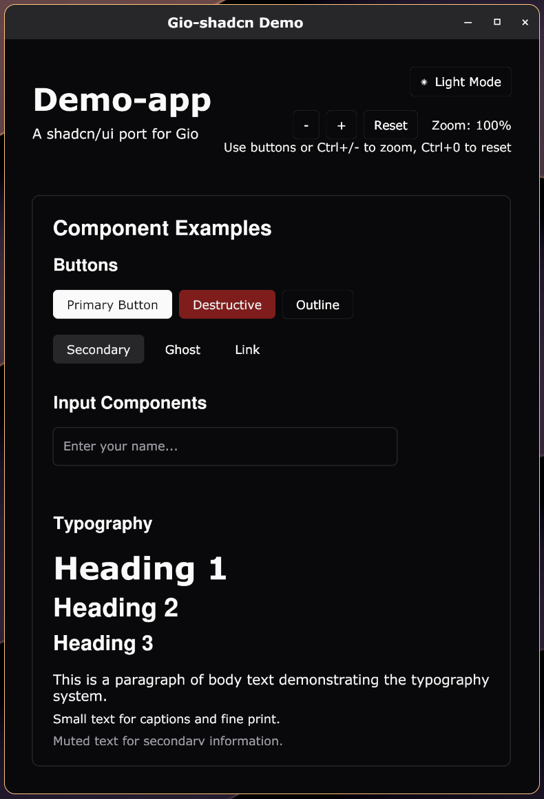

# gio-shadcn

A Go port of [shadcn/ui](https://ui.shadcn.com/) for [Gio](https://gioui.org/), bringing beautiful, accessible, and customizable UI components to your Gio applications.



## Features

- 🎨 **Themeable**: JSON-based theme configuration with light/dark mode support
- 🧩 **Modular**: Each component is independently importable
- 💻 **Simple Imports**: Standard Go module imports, no CLI needed
- 🔧 **Type Safe**: Full Go type safety with validation
- 📦 **Copy-Paste Friendly**: Components are copied to your project, not imported as dependencies
- 🎯 **Gio Native**: Built specifically for Gio's immediate-mode architecture

## Quick Start

### Installation

Add gio-shadcn to your Go project:
```bash
go get github.com/bnema/gio-shadcn@latest
```

### Usage

Import the components you need:
```go
import (
    "github.com/bnema/gio-shadcn/components/button"
    "github.com/bnema/gio-shadcn/components/card"
    "github.com/bnema/gio-shadcn/components/input"
    "github.com/bnema/gio-shadcn/theme"
)
```

That's it! No CLI tool needed, no files to download. Use standard Go imports.

### Getting Started

Create a new Go project and add gio-shadcn:

```bash
mkdir my-gio-app
cd my-gio-app
go mod init my-gio-app
go get github.com/bnema/gio-shadcn@latest
```

## Usage

### Basic Button Example

```go
package main

import (
    "gioui.org/app"
    "gioui.org/io/system"
    "gioui.org/layout"
    "gioui.org/op"
    
    "github.com/bnema/gio-shadcn/components/button"
    "github.com/bnema/gio-shadcn/theme"
)

func main() {
    go func() {
        w := app.NewWindow(app.Title("gio-shadcn Demo"))
        defer w.Close()
        
        th := theme.New()
        
        // Create button with functional options
        btn := button.NewButton(
            button.WithText("Click me"),
            button.WithVariant(theme.VariantDefault),
            button.WithOnClick(func() {
                println("Button clicked!")
            }),
        )
        
        var ops op.Ops
        
        for {
            e := w.NextEvent()
            switch e := e.(type) {
            case system.DestroyEvent:
                return
            case system.FrameEvent:
                gtx := layout.NewContext(&ops, e)
                
                layout.Center.Layout(gtx, func(gtx layout.Context) layout.Dimensions {
                    return btn.Layout(gtx, th)
                })
                
                e.Frame(gtx.Ops)
            }
        }
    }()
    app.Main()
}
```

### Advanced Usage with Multiple Components

```go
package main

import (
    "gioui.org/app"
    "gioui.org/io/system"
    "gioui.org/layout"
    "gioui.org/op"
    
    "github.com/bnema/gio-shadcn/components/button"
    "github.com/bnema/gio-shadcn/components/card"
    "github.com/bnema/gio-shadcn/components/input"
    "github.com/bnema/gio-shadcn/theme"
)

func main() {
    go func() {
        w := app.NewWindow(app.Title("gio-shadcn Advanced Demo"))
        defer w.Close()
        
        th := theme.New()
        
        // Create components
        nameInput := input.New(input.Config{
            Placeholder: "Enter your name",
            Type:        input.InputText,
        })
        
        submitBtn := button.NewButton(
            button.WithText("Submit"),
            button.WithVariant(theme.VariantDefault),
            button.WithOnClick(func() {
                println("Name:", nameInput.Text())
            }),
        )
        
        card := card.NewCard(
            card.WithCardPadding(layout.Inset{Top: 24, Right: 24, Bottom: 24, Left: 24}),
        )
        
        var ops op.Ops
        
        for {
            e := w.NextEvent()
            switch e := e.(type) {
            case system.DestroyEvent:
                return
            case system.FrameEvent:
                gtx := layout.NewContext(&ops, e)
                
                layout.Center.Layout(gtx, func(gtx layout.Context) layout.Dimensions {
                    return card.Layout(gtx, th, func(gtx layout.Context) layout.Dimensions {
                        return layout.Flex{Axis: layout.Vertical}.Layout(gtx,
                            layout.Rigid(func(gtx layout.Context) layout.Dimensions {
                                return nameInput.Layout(gtx, th)
                            }),
                            layout.Rigid(func(gtx layout.Context) layout.Dimensions {
                                return layout.Spacer{Height: th.Spacing.Space4}.Layout(gtx)
                            }),
                            layout.Rigid(func(gtx layout.Context) layout.Dimensions {
                                return submitBtn.Layout(gtx, th)
                            }),
                        )
                    })
                })
                
                e.Frame(gtx.Ops)
            }
        }
    }()
    app.Main()
}
```


## Component Variants

### Button Variants
- `VariantDefault` - Default button style
- `VariantDestructive` - Destructive/danger button
- `VariantOutline` - Outline button
- `VariantSecondary` - Secondary button
- `VariantGhost` - Ghost button
- `VariantLink` - Link-style button

### Button Sizes
- `SizeDefault` - Default size
- `SizeSM` - Small size
- `SizeLG` - Large size
- `SizeIcon` - Icon-only size

## Theme Configuration

### Colors

The theme system supports comprehensive color customization:

```json
{
  "colors": {
    "light": {
      "background": "#ffffff",
      "foreground": "#0a0a0a",
      "primary": "#0f172a",
      "primary-foreground": "#f8fafc",
      "secondary": "#f1f5f9",
      "secondary-foreground": "#0f172a",
      "muted": "#f1f5f9",
      "muted-foreground": "#64748b",
      "accent": "#f1f5f9",
      "accent-foreground": "#0f172a",
      "destructive": "#ef4444",
      "destructive-foreground": "#f8fafc",
      "border": "#e2e8f0",
      "input": "#e2e8f0",
      "ring": "#0f172a"
    },
    "dark": {
      "background": "#0a0a0a",
      "foreground": "#fafafa",
      "primary": "#fafafa",
      "primary-foreground": "#0a0a0a",
      "secondary": "#262626",
      "secondary-foreground": "#fafafa",
      "muted": "#262626",
      "muted-foreground": "#a1a1aa",
      "accent": "#262626",
      "accent-foreground": "#fafafa",
      "destructive": "#7f1d1d",
      "destructive-foreground": "#fafafa",
      "border": "#262626",
      "input": "#262626",
      "ring": "#d4d4d8"
    }
  }
}
```

### Radius and Spacing

```json
{
  "radius": {
    "none": 0,
    "sm": 2,
    "md": 4,
    "lg": 8,
    "xl": 12,
    "2xl": 16,
    "3xl": 24,
    "full": 9999
  },
  "spacing": {
    "0": 0,
    "1": 4,
    "2": 8,
    "3": 12,
    "4": 16,
    "5": 20,
    "6": 24,
    "8": 32,
    "10": 40,
    "12": 48,
    "16": 64,
    "20": 80,
    "24": 96
  }
}
```

### Runtime Theme Loading

```go
// Load theme from JSON file
th, err := theme.NewThemeFromJSON("theme.json")
if err != nil {
    log.Fatal(err)
}

// Toggle dark mode
th.ToggleDark()

// Validate theme
if err := theme.ValidateTheme(th); err != nil {
    log.Fatal(err)
}
```

## Component Progress

### ✅ Ported Components (5/51)

| Component | Import Path | Status | Description |
|-----------|-------------|--------|-------------|
| Button | `github.com/bnema/gio-shadcn/components/button` | ✅ Complete | Customizable button with variants and sizes |
| Card | `github.com/bnema/gio-shadcn/components/card` | ✅ Complete | Flexible container for content |
| Input | `github.com/bnema/gio-shadcn/components/input` | ✅ Complete | Text input with validation |
| Label | `github.com/bnema/gio-shadcn/components/label` | ✅ Complete | Typography component |
| Titlebar | `github.com/bnema/gio-shadcn/components/titlebar` | ✅ Complete | Window titlebar component |

### 🚧 Missing Components (46/51)

| Component | Priority | Description |
|-----------|----------|-------------|
| Accordion | High | Collapsible content areas |
| Alert | High | Display important messages |
| Alert Dialog | High | Modal dialog for alerts |
| Aspect Ratio | Medium | Maintain aspect ratios |
| Avatar | Medium | User profile pictures |
| Badge | High | Small status indicators |
| Breadcrumb | Medium | Navigation breadcrumbs |
| Calendar | Medium | Date selection |
| Carousel | Low | Image/content slider |
| Chart | Low | Data visualization |
| Checkbox | High | Boolean input control |
| Collapsible | Medium | Expandable content |
| Combobox | High | Searchable select |
| Command | Medium | Command palette |
| Context Menu | Medium | Right-click menus |
| Data Table | High | Tabular data display |
| Date Picker | High | Date selection input |
| Dialog | High | Modal dialogs |
| Drawer | Medium | Slide-out panels |
| Dropdown Menu | High | Dropdown selections |
| React Hook Form | N/A | Form handling (React specific) |
| Hover Card | Low | Hover tooltips |
| Input OTP | Medium | One-time password input |
| Menubar | Medium | Application menu bar |
| Navigation Menu | High | Site navigation |
| Pagination | High | Page navigation |
| Popover | Medium | Floating content |
| Progress | High | Progress indicators |
| Radio Group | High | Single selection from options |
| Resizable | Low | Resizable panels |
| Scroll-area | Medium | Custom scrollbars |
| Select | High | Dropdown selection |
| Separator | High | Visual dividers |
| Sheet | Medium | Side panels |
| Sidebar | High | Navigation sidebar |
| Skeleton | Medium | Loading placeholders |
| Slider | High | Range input control |
| Sonner | Low | Toast notifications |
| Switch | High | Toggle switch |
| Table | High | Data tables |
| Tabs | High | Tabbed content |
| Textarea | High | Multi-line text input |
| Toast | High | Notification messages |
| Toggle | High | Toggle button |
| Toggle Group | Medium | Group of toggle buttons |
| Tooltip | High | Hover information |
| Typography | Medium | Text styling utilities |

**Progress: 5/51 components ported (9.8%)**

## Component API

### Button

```go
// Create with functional options
btn := button.NewButton(
    button.WithText("Click me"),
    button.WithVariant(theme.VariantDefault),
    button.WithSize(theme.SizeDefault),
    button.WithOnClick(func() { /* handle click */ }),
    button.WithDisabled(false),
    button.WithClasses("custom-class"),
)

// Create with configuration struct
btn := button.New(button.Config{
    Text:    "Click me",
    Variant: theme.VariantDefault,
    Size:    theme.SizeDefault,
    OnClick: func() { /* handle click */ },
})

// Layout and update
dims := btn.Layout(gtx, th)
state := btn.Update(gtx)

// Check component state
if state.IsPressed() {
    // Handle pressed state
}
```

### Card

```go
// Create card
card := card.NewCard(
    card.WithCardVariant(theme.VariantDefault),
    card.WithCardPadding(layout.Inset{Top: 24, Right: 24, Bottom: 24, Left: 24}),
)

// Layout with content
dims := card.Layout(gtx, th, func(gtx layout.Context) layout.Dimensions {
    // Card content goes here
    return layout.Dimensions{}
})
```

### Input

```go
// Create input
input := input.New(input.Config{
    Placeholder: "Enter text",
    Type:        input.InputText,
    Label:       "Name",
    Required:    true,
})

// Handle input events
input.WithOnChange(func(value string) {
    println("Input changed:", value)
})

// Get current value
value := input.Text()
```

## Development

### Building from Source

1. Clone the repository:
```bash
git clone https://github.com/bnema/gio-shadcn.git
cd gio-shadcn
```

2. Install dependencies:
```bash
go mod download
```

3. Run the demo:
```bash
go run ./cmd/demo-app
```

### Adding New Components

1. Create a new component directory:
```bash
mkdir components/newcomponent
```

2. Create the component file:
```go
package newcomponent

import (
    "gioui.org/layout"
    "github.com/bnema/gio-shadcn/theme"
)

type NewComponent struct {
    // Component fields
}

func (nc *NewComponent) Layout(gtx layout.Context, th *theme.Theme) layout.Dimensions {
    // Component implementation
}

func (nc *NewComponent) Update(gtx layout.Context) theme.ComponentState {
    // Component state
}
```

3. Add to registry.json:
```json
{
  "components": {
    "newcomponent": {
      "name": "newcomponent",
      "description": "Description of the new component",
      "files": ["newcomponent.go"],
      "dependencies": ["theme", "utils"],
      "version": "1.0.0",
      "category": "form"
    }
  }
}
```

## Contributing

1. Fork the repository
2. Create a feature branch
3. Add your component or feature
4. Update documentation
5. Submit a pull request

## License

MIT License - see LICENSE file for details

## Credits

- Inspired by [shadcn/ui](https://ui.shadcn.com/)
- Built with [Gio](https://gioui.org/)
- Thanks to all contributors

## Support

- [GitHub Issues](https://github.com/bnema/gio-shadcn/issues)
- [Documentation](https://github.com/bnema/gio-shadcn/wiki)
- [Examples](https://github.com/bnema/gio-shadcn/tree/main/examples)